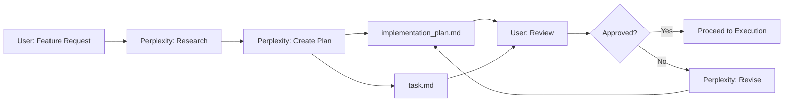
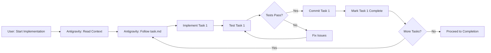
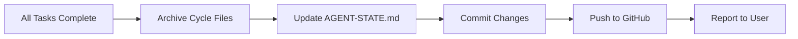

# 🔄 AI Development Workflow (Perplexity Era)

> **Status:** Aktualizováno listopad 2025  
> **OSS/Gemini/ostatní staré workflow neplatí**

---

## 🎭 Current Roles & Responsibilities

### 1. 👨‍💻 User (Lead Developer & Product Owner)
**Role:** Directs project, approves changes, provides requirements

**Responsibilities:**
- Defines feature requirements and priorities
- Reviews implementation plans before execution
- Approves architectural decisions
- Monitors progress via `AGENT-STATE.md` and `task.md`
- Makes final decisions on design/architecture
- Deploys to production (when ready)

**Tools:**
- GitHub for code review
- IDE for monitoring changes
- `.ai-context/` files for tracking progress

---

### 2. 🧠 Perplexity (AI Architect)
**Role:** Strategic planning, architecture, research

**Input:**
- User requirements
- Current project state (`AGENT-STATE.md`)
- Project vision (`PROJECT_CORE.md`)
- Technical constraints (`ARCHITECTURE.md`)

**Output:**
- `implementation_plan.md` - Detailed technical design
- `task.md` - Step-by-step checklist for Antigravity
- Research documents
- Strategic recommendations
- Architectural decisions

**Goal:**
- Ensure decisions are sound and scalable
- Align technical implementation with vision
- Provide clear direction for execution
- Consider long-term maintainability

**Constraints:**
- Does NOT write code directly
- Plans must be user-approved before execution
- Must reference existing guidelines and constraints

---

### 3. ⚡ Antigravity (AI Executor) - Claude Sonnet 4.5 Thinking
**Role:** All implementation, testing, commits, deployment

**Input (Must Read Before Every Task):**
1. `.ai-context/PROJECT_CORE.md` - Vision, MVP, curriculum
2. `.ai-context/CONTENT_GUIDELINES.md` - Design system, components
3. `.ai-context/ARCHITECTURE.md` - Tech stack, ports, dependencies
4. `.ai-context/implementation_plan.md` - Current cycle plan
5. `.ai-context/task.md` - Checklist for current cycle
6. `.ai-context/AGENT-STATE.md` - Historical context

**Output:**
- Working code (production-ready)
- Unit/integration tests
- Git commits (atomic, descriptive)
- Updated `AGENT-STATE.md`
- Updated `task.md` (marks progress `[x]`)
- Archived cycle files (when complete)

**Constraints:**
- Follows plans strictly (from `implementation_plan.md`)
- Does NOT invent features outside plan
- Tests before committing (ALWAYS)
- Commits after each completed task
- Asks for clarification if requirements ambiguous
- Works autonomously within plan boundaries

**Best Practices:**
- Senior-level code quality
- Proper error handling
- Type safety (TypeScript, Python type hints)
- Educational comments (`// LEARN:` for complex logic)
- No placeholder code (`// TODO` forbidden)

---

## 🔄 The Development Cycle

### Phase 1: Planning (User → Perplexity)



**Steps:**
1. User describes desired feature/change
2. Perplexity analyzes requirements
3. Perplexity researches best practices
4. Perplexity creates `implementation_plan.md` (technical design)
5. Perplexity creates `task.md` (actionable checklist)
6. User reviews and approves (or requests changes)

**Example:**
```
User: "I want to add XP system to track student progress"
↓
Perplexity: 
  - Researches gamification best practices
  - Designs database schema
  - Plans UI components
  - Creates implementation_plan.md
  - Creates task.md with 10 steps
↓
User: Reviews plan → Approves
```

---

### Phase 2: Execution (User → Antigravity)



**Steps:**
1. User: "Implement according to plan"
2. Antigravity reads all context files
3. Antigravity follows `task.md` step-by-step
4. For each task:
   - Implement code
   - Test thoroughly
   - If tests pass → Commit
   - If tests fail → Fix and re-test
   - Mark task `[x]` in `task.md`
5. Repeat until all tasks complete

**Example:**
```
task.md:
[ ] Task 1: Add xp_earned column to User model
[ ] Task 2: Create XP calculation service
[ ] Task 3: Update lesson completion endpoint

↓ Antigravity executes:

Task 1:
  - Add column to models/user.py
  - Create migration
  - Test migration works
  - Commit: "feat: add xp_earned to user model"
  - Mark [x]

Task 2:
  - Create services/xp_service.py
  - Write unit tests
  - Tests pass
  - Commit: "feat: add XP calculation service"
  - Mark [x]

... continues until all [x]
```

---

### Phase 3: Completion (Antigravity → User)



**Steps (Automatic when all tasks `[x]`):**
1. Create archive directory: `.ai-context/completed_cycles/cycle_XX/`
2. Move files:
   - `implementation_plan.md` → `completed_cycles/cycle_XX/`
   - `task.md` → `completed_cycles/cycle_XX/`
3. Update `AGENT-STATE.md`:
   - Mark cycle as complete ✅
   - Summarize accomplishments
   - Note key learnings
4. Commit all changes:
   ```bash
   git commit -m "chore: complete cycle XX"
   ```
5. Push to GitHub:
   ```bash
   git push origin main
   ```
6. Report to user:
   ```
   ✅ Cycle XX completed. All tasks done. Pushed to GitHub.
   ```

---

## 🏁 Cycle Closing Ritual (Automated)

When Antigravity sees all tasks marked `[x]` in `task.md`:

### Automatic Actions:
```bash
# 1. Archive cycle files
mkdir -p .ai-context/completed_cycles/cycle_XX
mv .ai-context/implementation_plan.md .ai-context/completed_cycles/cycle_XX/
mv .ai-context/task.md .ai-context/completed_cycles/cycle_XX/

# 2. Update AGENT-STATE.md (Antigravity edits file)
# - Current Cycle: XX (COMPLETED ✅)
# - Latest Accomplishment: [summary]
# - Add cycle to history

# 3. Commit everything
git add .ai-context/
git commit -m "chore: complete cycle XX

- Archived implementation_plan.md and task.md
- Updated AGENT-STATE.md with completion status
- [Brief summary of what was accomplished]"

# 4. Push to GitHub
git push origin main
```

### Manual Actions (User):
- None required (fully automated)
- User can review changes in GitHub

---

## 📂 Key Files (The Interface)

### For Everyone (Always Read):
| File | Purpose | Readers | Writers |
|------|---------|---------|---------|
| `PROJECT_CORE.md` | Vision, MVP, curriculum | All | User |
| `CONTENT_GUIDELINES.md` | Design system | All | User + Perplexity |
| `ARCHITECTURE.md` | Tech stack, ports | All | User + Perplexity |
| `AGENT-STATE.md` | Current status, history | All | Antigravity |

### For Planning (Perplexity Creates):
| File | Purpose | Readers | Writers |
|------|---------|---------|---------|
| `implementation_plan.md` | Technical design | User, Antigravity | Perplexity |
| `task.md` | Step-by-step checklist | User, Antigravity | Perplexity |

### For Execution (Antigravity Uses):
| File | Purpose | Readers | Writers |
|------|---------|---------|---------|
| `implementation_plan.md` | What to build | Antigravity | Perplexity |
| `task.md` | Progress tracking | Antigravity | Perplexity (creates), Antigravity (updates) |
| `AGENT-STATE.md` | Status updates | All | Antigravity |

### Archive (Historical Record):
| Directory | Purpose |
|-----------|---------|
| `completed_cycles/` | Finished implementation plans |
| `archive/` | Deprecated files (e.g., gemini-era) |

---

## 🔄 Workflow Comparison

### ❌ Old Pattern (Gemini Era - Deprecated)

```
User
  ↓ (runs context_builder.py)
Gemini (Architect)
  ↓ (creates plans in chat)
User
  ↓ (copy-paste to files)
Antigravity (Executor)
  ↓ (executes)
User
  ↓ (manual cycle closing)
```

**Issues:**
- Manual context building required
- Copy-paste friction
- Manual cycle management
- Gemini couldn't write files directly

---

### ✅ Current Pattern (Perplexity Era)

```
User
  ↓ (describes feature)
Perplexity (Architect)
  ↓ (creates implementation_plan.md + task.md)
User
  ↓ (approves plan)
Antigravity (Executor)
  ↓ (reads files → executes → commits → closes cycle)
User
  ↓ (verifies on GitHub)
```

**Advantages:**
- File-based (no context_builder.py)
- Direct file creation by Perplexity
- Autonomous execution by Antigravity
- Automatic cycle closing
- Better long-term memory

---

## 💡 Communication Patterns

### User → Perplexity (Planning)
```
"I need [feature/change]"
"Research best practices for [topic]"
"Design architecture for [system]"
"Create implementation plan for [feature]"
```

### User → Antigravity (Execution)
```
"Implement according to plan"
"Continue with next task"
"Fix [specific issue]"
"Update [specific file]"
```

### Antigravity → User (Updates)
```
"✅ Task 1 complete: [description]"
"⚠️ Issue found: [description], need clarification"
"✅ Cycle XX complete, pushed to GitHub"
```

---

## 🚫 What Changed from Gemini Era

### Removed:
- ❌ `context_builder.py` script
- ❌ Manual copy-paste between agents
- ❌ Gemini as architect
- ❌ Manual cycle closing
- ❌ `HISTORY.md` updates (now in `AGENT-STATE.md`)

### Added:
- ✅ Perplexity as architect
- ✅ Direct file-based workflow
- ✅ Autonomous cycle completion
- ✅ Clearer role separation

### Kept:
- ✅ File-based context (`.ai-context/`)
- ✅ Implementation plans and task checklists
- ✅ Git hygiene (atomic commits)
- ✅ Production-ready quality standards

---

## 🎯 Best Practices

### For Users:
- **Clear requests:** Specify planning vs execution
- **Review plans:** Always check `implementation_plan.md` before approving
- **Trust the system:** Let Antigravity work autonomously
- **Monitor progress:** Check `AGENT-STATE.md` and `task.md`

### For Perplexity:
- **Clear plans:** Write detailed, actionable `implementation_plan.md`
- **Specific tasks:** Create concrete `task.md` checklist
- **Consider constraints:** Reference `ARCHITECTURE.md`
- **User-friendly:** Plans should be reviewable by non-technical users

### For Antigravity:
- **Read context first:** Always load all `.ai-context/` files
- **Test before commit:** NEVER commit broken code
- **Atomic commits:** One task = one commit
- **Update progress:** Mark tasks `[x]` in `task.md`
- **Senior quality:** Production-ready code only
- **Ask when unclear:** Don't guess, ask user

---

## 🆘 Troubleshooting

### Antigravity Encounters Issues:

**Unclear Requirements:**
```
Antigravity: "Task 3 is ambiguous. Should I use approach A or B?"
User: [Clarifies or consults Perplexity]
```

**Technical Blocker:**
```
Antigravity: "Library X is not in ARCHITECTURE.md. Can I add it?"
User: [Decides or asks Perplexity to research]
```

**Guideline Conflict:**
```
Antigravity: "implementation_plan.md says X, but CONTENT_GUIDELINES.md says Y"
User: [Clarifies priority]
```

### User Needs Help:

**Strategic Decision:**
```
User → Perplexity: "Should we use REST or GraphQL?"
Perplexity: [Researches, recommends, creates plan]
```

**Quick Fix:**
```
User → Antigravity: "Fix typo in lesson 2"
Antigravity: [Fixes → Tests → Commits]
```

---

## 📊 Success Metrics

### Workflow is Working When:
- ✅ Plans are clear and actionable
- ✅ Execution happens without clarification questions
- ✅ All commits are atomic and tested
- ✅ Cycles complete autonomously
- ✅ No confusion about roles
- ✅ User can track progress easily

### Warning Signs:
- ⚠️ Frequent clarification requests (plan not clear enough)
- ⚠️ Broken commits (testing not thorough)
- ⚠️ Manual cycle closing (automation failed)
- ⚠️ Conflicting guidelines (documentation needs update)

---

**Last Updated:** Listopad 2025 (Cycle 17)  
**Agent Architecture:** Perplexity (Architect) + Antigravity (Executor)  
**OSS/Gemini/ostatní agenti se NEpoužívají pro tento projekt**