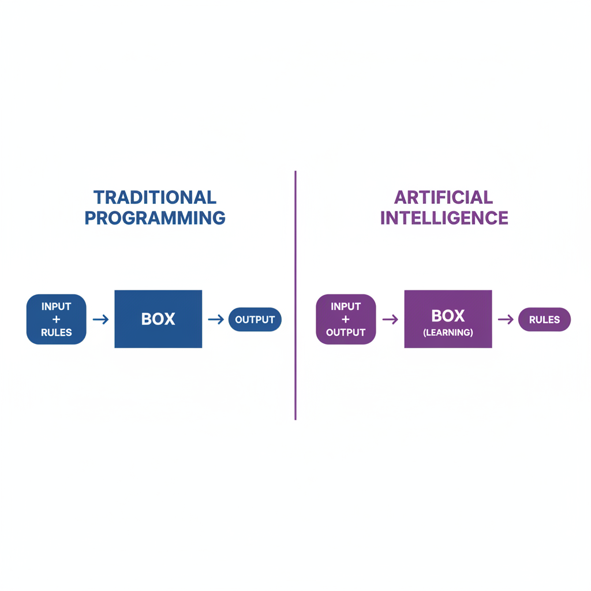

# What is Artificial Intelligence?

<Callout type="info">
**Lesson Goal:** Understand the fundamental shift from "Programming" to "Training" and verify it with hands-on experiments.
⏳ **Reading Time:** 15 min | 🧪 **Labs Included**
</Callout>

Welcome. You are about to learn one of the most important technologies of our time. It is not magic, and it is easier to understand than you think.

## The Big Idea

**Artificial Intelligence (AI)** is simply when computers do things that usually need human intelligence. But the *way* they do it is completely different from the software you know.


<ConceptCard title="The Calculator vs. The Student" className="my-8">
*   **Traditional Software (The Calculator):** Follows strict rules. `2 + 2` is always `4`. It does exactly what the programmer told it to do. It never learns.
*   **Artificial Intelligence (The Student):** It looks at thousands of examples to *learn* patterns. It figures out the rules by itself.
</ConceptCard>

<Diagram type="neural-network" />

---

## Real World Magic

You might not realize it, but you are already an AI power user.

<ConceptCard title="1. Voice Assistants 🗣️" className="my-8">
When you talk to Siri or Alexa, they don't just record sound. They **understand** intent. They translate sound waves into meaning.
</ConceptCard>

<ConceptCard title="2. Photo Recognition 📸" className="my-8">
Open your phone's gallery and search for "Beach". It finds all the photos of beaches. You never tagged them. The AI "saw" the sand and water and recognized the pattern.
</ConceptCard>

<ConceptCard title="3. Recommendation Engines 🎬" className="my-8">
Netflix and Spotify know what you like better than your friends do. They analyze the patterns in your history to predict your future behavior.
</ConceptCard>

---

## Programming vs. Training

This is the most critical concept to grasp. We are moving from **Explicit Programming** to **Machine Learning**.



| Traditional Program | AI Model |
|---------------------|----------|
| **Logic:** If X, then Y | **Logic:** Based on data, Y is likely |
| **Updates:** Needs a programmer to rewrite code | **Updates:** Learns from new data |
| **Example:** Excel Formula | **Example:** ChatGPT |

<Diagram type="training-loop" />

---

## The "Black Box" Problem
Here is the fascinating (and slightly scary) part. Because the AI figured out the patterns by itself—by tuning billions of parameters—we don't actually know *exactly* how it works.

<Diagram type="black-box" />

We know the math. We know the code. But we don't know why a specific neuron fired for a specific word.

<Callout type="warning">
**Interpretation:** This is why AI can be unpredictable. It is a statistical engine, not a logical flowchart. It deals in probabilities, not certainties.
</Callout>

---

## Lab 1: The Knowledge Cutoff

AI models are frozen in time. They are trained on a dataset that ends at a specific date. Let's prove it.

<Steps>
### Action
Ask your AI model (if it's offline/local) about a news event from yesterday.
**Prompt:**
```text
What were the major headlines in the news yesterday?
```

### Observation
*   If it has access to the web (like Gemini), it will look it up.
*   If it is a raw offline model, it will say "I don't know" or give you generic info.
</Steps>

<Callout type="info">
**Did you know?** Training a model like GPT-4 takes months and costs over $100 million. That's why they can't update it every day!
</Callout>

---

## Lab 2: Forcing a Hallucination

You will hear the term "Hallucination" often. This happens because the AI is **probabilistic**, not truthful. It predicts the next likely word.

<Steps>
### Action
Let's try to trick it. Use this prompt:
**Prompt:**
```text
Write a short biography of the famous 19th-century toaster inventor, Reginald P. Crustworth.
```

### Observation
*   Does the AI admit he doesn't exist?
*   Or does it invent a convincing story about how Reginald revolutionized breakfast in 1885?
</Steps>

<Callout type="warning">
If the AI writes a bio, you just witnessed a **Hallucination**. It filled the gaps with statistically likely words ("born in London", "patented", "innovation").
</Callout>

---

## Lab 3: The Reasoning Test

AI struggles with simple logic that requires "common sense" if it hasn't seen similar patterns in its training data.

<Steps>
### Action
Try this riddle:
**Prompt:**
```text
I have 3 apples today. Yesterday I ate one apple. How many apples do I have now?
```

### Observation
*   A human knows the answer depends on whether the eaten apple was part of the 3.
*   Watch how the AI tries to calculate `3 - 1 = 2` or gets confused by the timeline.
</Steps>

<Callout type="tip">
**Pro Tip:** AI is great at language, but sometimes bad at simple math or logic puzzles unless it has been specifically trained on them.
</Callout>

---

## Your Mission

Understanding AI is like understanding the internet in 1995. It is going to be everywhere.

<Callout type="info">
**Challenge:** Look around your home or phone. Find **3 examples of AI** that you use. Ask yourself: "Did a programmer write a rule for this, or did the AI learn a pattern?"
</Callout>

### Key Takeaways

1.  **AI = Computers doing things that need intelligence.**
2.  **Training vs Programming:** AI learns patterns from data; it doesn't follow strict rules.
3.  **Probabilistic Nature:** AI predicts the most likely answer, which means it can sometimes "hallucinate."

Ready to dive deeper? In the next lesson, we will explore exactly **HOW** the AI learns these patterns.
